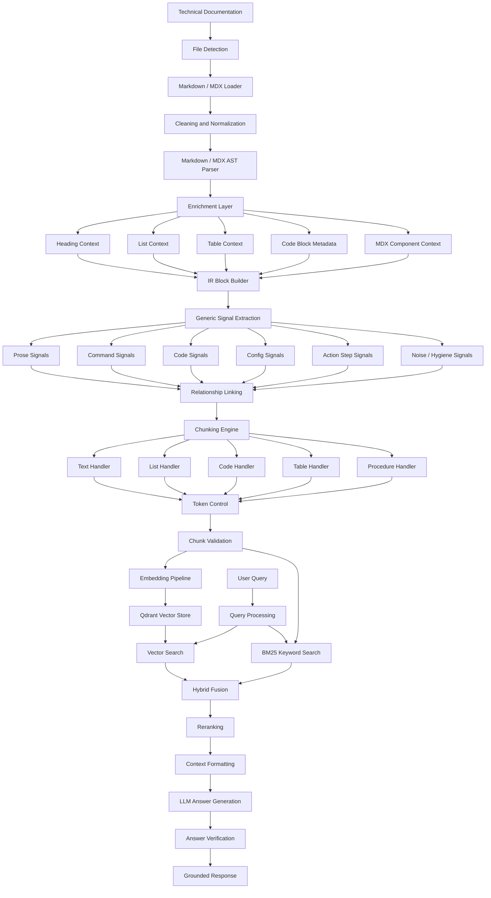
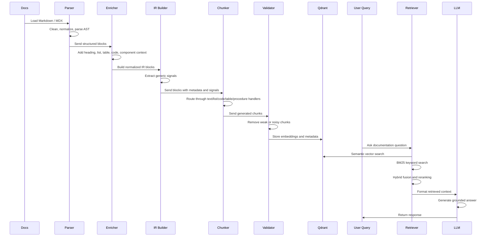
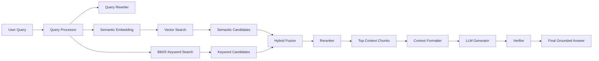
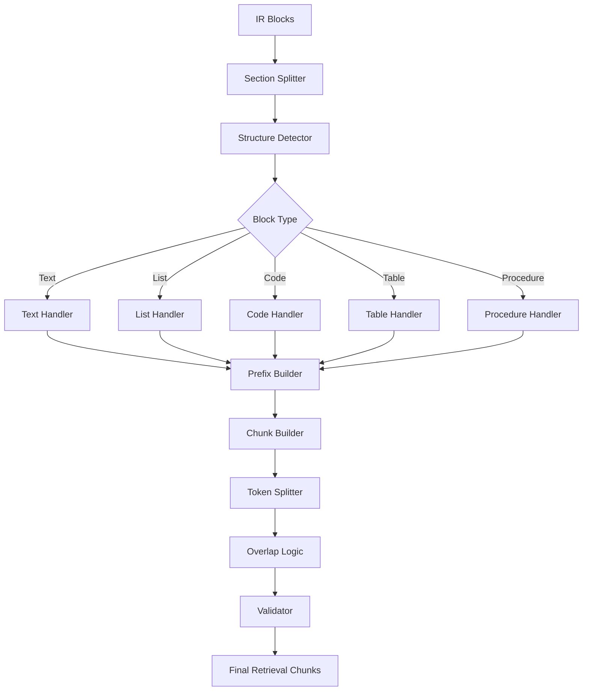

# AI Documentation Assistant

A structure-aware Retrieval-Augmented Generation system for technical documentation. It converts Markdown and MDX docs into searchable, metadata-rich knowledge chunks, then uses hybrid retrieval, reranking, and LLM-based generation to produce grounded answers.

> Status: Work in progress. The current focus is building a high-quality ingestion, chunking, retrieval, and answer-generation pipeline for complex technical documentation.

---

## Project Snapshot

| Category           | Details                                                                        |
| ------------------ | ------------------------------------------------------------------------------ |
| Project Type       | Documentation-focused RAG chatbot                                              |
| Primary Goal       | Answer questions from technical documentation using grounded retrieved context |
| Core Strength      | Structure-aware parsing instead of naive fixed-size text splitting             |
| Input Focus        | Markdown and MDX documentation                                                 |
| Retrieval Strategy | Vector search + BM25 keyword search + hybrid fusion + reranking                |
| Storage Layer      | Qdrant vector database                                                         |
| Answer Layer       | LLM-based response generation with query rewriting and verification            |
| Current Stage      | Experimental / work in progress                                                |

---

## Why This Project Exists

Most simple RAG systems split documentation into fixed-size chunks and directly embed those chunks. That can work for plain text, but technical documentation is different.

Technical docs often contain:

| Documentation Element | Why It Matters                                                     |
| --------------------- | ------------------------------------------------------------------ |
| Headings              | Define the scope and meaning of the content below them             |
| Code blocks           | Often contain the actual solution or implementation detail         |
| CLI commands          | Require exact matching and should not be treated like normal prose |
| Tables                | Store configuration, API options, parameters, and comparisons      |
| Lists                 | Represent steps, grouped options, or nested instructions           |
| Notes and warnings    | Contain constraints, caveats, and important edge cases             |
| MDX components        | Add semantic structure that normal Markdown parsing may lose       |

If these structures are split incorrectly, retrieval quality drops. A command may get separated from its explanation, a table may lose its headers, or a code block may be retrieved without its surrounding context.

This project explores a more careful RAG pipeline where documents are parsed structurally before embedding and retrieval.

---

## High-Level Architecture



---

## Architecture Layers

| Layer                | Responsibility                                                | Output                      |
| -------------------- | ------------------------------------------------------------- | --------------------------- |
| Document Loading     | Reads supported documentation files from disk                 | Raw document text           |
| File Type Detection  | Identifies Markdown or MDX input                              | Document type metadata      |
| Cleaning             | Removes noisy formatting while preserving useful structure    | Cleaned text                |
| MDX Normalization    | Converts MDX-specific patterns into parser-friendly content   | Normalized MDX text         |
| AST Parsing          | Parses Markdown/MDX into structured elements                  | Document element tree       |
| Enrichment           | Adds heading, table, list, text, and component context        | Enriched blocks             |
| IR Block Building    | Converts enriched content into standardized blocks            | Intermediate representation |
| Signal Extraction    | Adds generic NLP and syntax features                          | Block-level signals         |
| Relationship Linking | Connects related blocks that should remain contextually close | Linked block graph          |
| Chunking             | Converts blocks into retrieval-ready chunks                   | Structured chunks           |
| Token Control        | Keeps chunks within practical token limits                    | Token-safe chunks           |
| Validation           | Removes weak, duplicate, empty, or noisy chunks               | Validated chunks            |
| Embedding            | Converts chunks into dense vectors                            | Embedding records           |
| Vector Storage       | Stores vectors and metadata in Qdrant                         | Searchable vector index     |
| Keyword Search       | Retrieves exact lexical matches using BM25                    | Keyword candidates          |
| Hybrid Retrieval     | Combines semantic and keyword candidates                      | Fused candidates            |
| Reranking            | Reorders candidates by relevance                              | Ranked context              |
| Generation           | Builds final answer using retrieved context                   | Grounded response           |

---

## End-to-End Pipeline



---

## Core Design Idea

The system does not try to hardcode knowledge about a specific framework, library, or product. Instead, it extracts generic structural and linguistic signals from documentation.

These signals help the system understand whether a block behaves like prose, code, a command, a configuration snippet, a warning, a reference section, or a procedural step.

| Signal Family   | Example Question It Helps Answer                                   |
| --------------- | ------------------------------------------------------------------ |
| Prose signals   | Does this block look like explanatory text?                        |
| Action signals  | Does this line look like an instruction or step?                   |
| Code signals    | Does this block contain code-like syntax?                          |
| Command signals | Does this line look like a CLI command?                            |
| Config signals  | Does this block look like key-value or option-based configuration? |
| Table signals   | Does this block contain structured rows and headers?               |
| Heading signals | Which section does this content belong to?                         |
| List signals    | Is this content part of a grouped or ordered flow?                 |
| Hygiene signals | Is this content malformed, noisy, duplicated, or unsafe to index?  |

These are feature extractors, not answer rules. They help preserve meaning before the document is embedded and indexed.

---

## Retrieval Architecture



---

## Why Hybrid Retrieval?

Technical documentation needs both meaning-based search and exact term matching.

| Query Type                | Vector Search Helps With                | BM25 Helps With                              |
| ------------------------- | --------------------------------------- | -------------------------------------------- |
| Conceptual questions      | Finds semantically related explanations | Matches important section terms              |
| CLI questions             | Finds related usage docs                | Matches command names and flags exactly      |
| Configuration questions   | Finds relevant setup explanations       | Matches config keys and option names         |
| API questions             | Finds related API descriptions          | Matches function, class, and parameter names |
| Error/debugging questions | Finds similar issue descriptions        | Matches exact error text                     |

Vector search understands meaning. BM25 preserves exact technical terms. Hybrid retrieval combines both so the system does not miss precise commands, flags, paths, or API names.

---

## Chunking Architecture



---

## Chunk Metadata

Each generated chunk is designed to carry retrieval-useful metadata.

| Metadata Field | Purpose                                                  |
| -------------- | -------------------------------------------------------- |
| Source file    | Tracks where the chunk came from                         |
| Heading path   | Preserves section hierarchy                              |
| Chunk type     | Identifies text, code, table, list, or procedure content |
| Subtype        | Gives more specific retrieval behavior                   |
| Token count    | Helps enforce retrieval and context-window limits        |
| Retrieval text | Cleaned text optimized for search                        |
| Context prefix | Adds lightweight heading/context information             |
| Signals        | Stores generic block-level NLP and syntax clues          |
| Relationships  | Links connected explanation/code/table/procedure blocks  |

---

## Tech Stack

| Layer           | Technology / Approach                                         |
| --------------- | ------------------------------------------------------------- |
| Language        | Python                                                        |
| Backend Style   | FastAPI-style backend and CLI utilities                       |
| Parsing         | Custom Markdown/MDX parsing pipeline                          |
| AST Processing  | Custom AST parser and enrichment modules                      |
| IR Layer        | Custom intermediate representation schema                     |
| Chunking        | Custom structure-aware chunking engine                        |
| Embeddings      | SentenceTransformers-style embedding pipeline                 |
| Vector Database | Qdrant                                                        |
| Keyword Search  | BM25                                                          |
| Retrieval       | Vector search, BM25 search, hybrid fusion                     |
| Reranking       | Query-aware reranking logic                                   |
| LLM Layer       | Query rewriting, context formatting, generation, verification |
| Memory          | Short-term and long-term conversation memory modules          |
| Configuration   | dotenv-based environment management                           |

---

## Repository Structure

```text
cloud-chatbot/
├── README.md
├── .gitignore
├── LICENSE
└── backend/
    ├── rag/
    │   ├── conversation/
    │   │   ├── formatter.py
    │   │   ├── long_term.py
    │   │   ├── manager.py
    │   │   ├── memory.py
    │   │   └── state.py
    │   │
    │   ├── generation/
    │   │   ├── formatting/
    │   │   │   └── context_formatter.py
    │   │   ├── llm/
    │   │   │   ├── client.py
    │   │   │   ├── generator.py
    │   │   │   ├── orchestrator.py
    │   │   │   ├── rewriter.py
    │   │   │   └── verifier.py
    │   │   └── prompting/
    │   │       ├── builder.py
    │   │       ├── context_block.py
    │   │       ├── dialogue.py
    │   │       ├── history_block.py
    │   │       ├── identity.py
    │   │       ├── reasoning.py
    │   │       ├── rules.py
    │   │       ├── structure.py
    │   │       └── style.py
    │   │
    │   ├── ingestion/
    │   │   ├── parser/
    │   │   │   ├── adapters/
    │   │   │   │   └── mdx_adapter.py
    │   │   │   ├── enrichment/
    │   │   │   │   ├── component_context.py
    │   │   │   │   ├── enricher.py
    │   │   │   │   ├── lists.py
    │   │   │   │   ├── metadata.py
    │   │   │   │   ├── tables.py
    │   │   │   │   └── texts.py
    │   │   │   ├── ir/
    │   │   │   │   ├── block_builder.py
    │   │   │   │   ├── relationships.py
    │   │   │   │   ├── schema.py
    │   │   │   │   └── signals.py
    │   │   │   ├── ast_parser.py
    │   │   │   ├── cleaner.py
    │   │   │   ├── filetype.py
    │   │   │   ├── heading_builder.py
    │   │   │   ├── list_parser.py
    │   │   │   ├── markdown.py
    │   │   │   ├── metadata.py
    │   │   │   └── table_parser.py
    │   │   │
    │   │   ├── chunking/
    │   │   │   ├── engine/
    │   │   │   │   ├── builders/
    │   │   │   │   │   ├── chunk_builder.py
    │   │   │   │   │   └── prefix_builder.py
    │   │   │   │   ├── detectors/
    │   │   │   │   │   ├── density.py
    │   │   │   │   │   ├── intent.py
    │   │   │   │   │   └── structure.py
    │   │   │   │   ├── handlers/
    │   │   │   │   │   ├── code.py
    │   │   │   │   │   ├── list.py
    │   │   │   │   │   ├── procedure.py
    │   │   │   │   │   ├── table.py
    │   │   │   │   │   └── text.py
    │   │   │   │   ├── splitters/
    │   │   │   │   │   ├── procedure.py
    │   │   │   │   │   ├── structured.py
    │   │   │   │   │   └── text.py
    │   │   │   │   ├── utils/
    │   │   │   │   │   └── grouping.py
    │   │   │   │   └── orchestrator.py
    │   │   │   ├── chunker.py
    │   │   │   ├── models.py
    │   │   │   ├── overlap.py
    │   │   │   ├── section_splitter.py
    │   │   │   ├── token_splitter.py
    │   │   │   ├── utils.py
    │   │   │   └── validator.py
    │   │   │
    │   │   └── embeddings/
    │   │       ├── embedder.py
    │   │       ├── pipeline.py
    │   │       ├── schema.py
    │   │       ├── store.py
    │   │       └── validator.py
    │   │
    │   ├── retrieval/
    │   │   ├── fusion/
    │   │   │   └── hybrid.py
    │   │   ├── keyword_search/
    │   │   │   └── bm25.py
    │   │   ├── reranking/
    │   │   │   └── reranker.py
    │   │   └── vector_search/
    │   │       └── cosine_similarity.py
    │   │
    │   ├── embed.py
    │   ├── parse_mdx.py
    │   ├── test_parser.py
    │   ├── chunk_test.py
    │   └── serve.py
    │
    └── docs/
```

---

## Important Modules

| Module                                            | Purpose                                                  |
| ------------------------------------------------- | -------------------------------------------------------- |
| `rag/ingestion/parser/__init__.py`                | Parser entrypoint for Markdown/MDX documents             |
| `rag/ingestion/parser/adapters/mdx_adapter.py`    | Normalizes MDX syntax before parsing                     |
| `rag/ingestion/parser/ast_parser.py`              | Converts documentation into structured AST-like elements |
| `rag/ingestion/parser/enrichment/enricher.py`     | Adds heading, table, list, text, and component context   |
| `rag/ingestion/parser/ir/signals.py`              | Extracts generic NLP and syntax signals                  |
| `rag/ingestion/parser/ir/block_builder.py`        | Builds standardized IR blocks                            |
| `rag/ingestion/parser/ir/relationships.py`        | Links related blocks for context preservation            |
| `rag/ingestion/chunking/chunker.py`               | Main chunking pipeline                                   |
| `rag/ingestion/chunking/engine/orchestrator.py`   | Routes blocks through specialized handlers               |
| `rag/ingestion/chunking/engine/handlers/text.py`  | Handles prose and explanation chunks                     |
| `rag/ingestion/chunking/engine/handlers/code.py`  | Handles code and command-like chunks                     |
| `rag/ingestion/chunking/engine/handlers/table.py` | Handles structured table chunks                          |
| `rag/ingestion/chunking/validator.py`             | Filters poor-quality chunks                              |
| `rag/ingestion/embeddings/pipeline.py`            | Generates embeddings for validated chunks                |
| `rag/ingestion/embeddings/store.py`               | Stores vectors and payloads in Qdrant                    |
| `rag/retrieval/keyword_search/bm25.py`            | Performs lexical keyword retrieval                       |
| `rag/retrieval/fusion/hybrid.py`                  | Combines semantic and keyword candidates                 |
| `rag/retrieval/reranking/reranker.py`             | Reranks retrieved chunks                                 |
| `rag/generation/llm/orchestrator.py`              | Coordinates rewriting, generation, and verification      |
| `rag/conversation/manager.py`                     | Manages conversation state                               |

---

## Project Capabilities

| Capability                 | Description                                                         |
| -------------------------- | ------------------------------------------------------------------- |
| Documentation ingestion    | Reads Markdown/MDX docs and prepares them for parsing               |
| Structure preservation     | Keeps section hierarchy, code context, tables, and lists meaningful |
| Generic heuristics         | Uses reusable NLP and syntax signals, not framework-specific rules  |
| Retrieval-ready chunks     | Produces chunks with metadata, context, and retrieval text          |
| Exact + semantic retrieval | Combines vector search with BM25 keyword search                     |
| Reranked answers           | Improves final context selection before generation                  |
| Grounded generation        | Generates answers from retrieved documentation context              |
| Conversation support       | Maintains context for follow-up interactions                        |

---

## Current Project Status

| Area                 | Status                   |
| -------------------- | ------------------------ |
| Markdown parsing     | In progress              |
| MDX normalization    | In progress              |
| AST parsing          | In progress              |
| Enrichment layer     | In progress              |
| IR block system      | In progress              |
| Relationship linking | In progress              |
| Chunking engine      | In progress              |
| Chunk validation     | In progress              |
| Embedding pipeline   | In progress              |
| Qdrant storage       | Integrated               |
| BM25 retrieval       | Integrated               |
| Hybrid retrieval     | Integrated               |
| Reranking            | Experimental             |
| LLM generation       | Integrated               |
| Conversation memory  | Basic implementation     |
| Production readiness | Not production-ready yet |

---

## Roadmap

| Priority | Task                                                                |
| -------- | ------------------------------------------------------------------- |
| High     | Improve MDX parsing accuracy on real-world documentation            |
| High     | Strengthen chunk validation and reduce noisy chunks                 |
| High     | Add retrieval evaluation with test queries and expected answers     |
| High     | Improve relationship linking between code, explanations, and tables |
| Medium   | Add source citation formatting in generated answers                 |
| Medium   | Add document upload API                                             |
| Medium   | Add frontend chat interface                                         |
| Medium   | Improve query rewriting and query intent detection                  |
| Medium   | Add chunk inspection/debugging UI                                   |
| Low      | Add automated parser quality benchmarks                             |
| Low      | Add deployment configuration                                        |

---

## Example Use Cases

| Use Case                        | Description                                               |
| ------------------------------- | --------------------------------------------------------- |
| Developer documentation chatbot | Answer questions from framework, SDK, or library docs     |
| API documentation assistant     | Retrieve accurate answers from API references             |
| Internal engineering assistant  | Search setup guides, internal docs, and engineering notes |
| CLI documentation assistant     | Answer command, flag, option, and workflow questions      |
| Technical onboarding assistant  | Help new developers understand project documentation      |
| Knowledge base search           | Improve search over structured technical content          |

---

## Design Goals

| Goal                          | Description                                                                                   |
| ----------------------------- | --------------------------------------------------------------------------------------------- |
| Preserve document structure   | Avoid losing meaning by splitting headings, explanations, code blocks, and tables incorrectly |
| Stay domain-independent       | Avoid framework-specific hardcoding and rely on generic parsing signals                       |
| Improve chunk quality         | Generate chunks that are useful for retrieval, not just arbitrary text fragments              |
| Support exact technical terms | Preserve commands, flags, config keys, paths, function names, and error text                  |
| Combine retrieval methods     | Use both semantic retrieval and keyword retrieval                                             |
| Keep answers grounded         | Generate responses from retrieved documentation context                                       |
| Make debugging easier         | Keep chunk types, metadata, and signals inspectable                                           |

---

## Notes

This project is experimental and under active development. The architecture is intentionally modular so that parsing, chunking, retrieval, reranking, and generation can be improved independently.

The current implementation is focused on backend RAG pipeline quality. A production-ready API, frontend, deployment setup, and full evaluation suite are planned future additions.

---

## License

This project is licensed under the MIT License.
